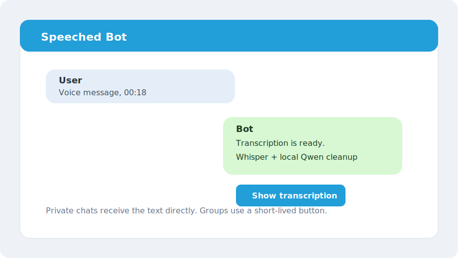

# Speeched

Telegram bot for private voice-message transcription. It runs Whisper locally
with `faster-whisper`, optionally asks a local llama.cpp/Qwen model to clean up
punctuation, and stores short-lived transcript metadata in SQLite.



## Features

- Private chats: send a voice message and receive a corrected transcription.
- Groups: disabled by default; members can use `/bot on`, `/bot off`, and `/bot`.
- Whisper model picker in private chat: `medium` or `large-v3-turbo`.
- Recognition language picker: `auto`, English, Ukrainian, or Russian.
- UI language picker: English or Ukrainian.
- Local LLM post-processing through llama.cpp API or CLI.
- SQLite persistence for group settings and temporary transcript callbacks.
- Rotating logs and retry handling for SQLite and llama.cpp.

## Requirements

- Python 3.10+
- `ffmpeg`
- Telegram bot token from BotFather
- llama.cpp server or CLI with a Qwen GGUF model
- Docker Compose for the recommended deployment path

## Quick start with Docker

```bash
cp .env.example .env
mkdir -p models whisper-cache data
```

Edit `.env` and set `BOT_TOKEN`. Place your GGUF model in `models/`, then adjust
the model filename in `docker-compose.yml` if needed.

```bash
docker compose up -d --build
docker compose logs -f bot
```

The compose file expects the llama.cpp service to be reachable as
`http://llama:8080` inside the Docker network.

## Native run

```bash
python3 -m venv .venv
source .venv/bin/activate
pip install -U pip
pip install -r requirements.txt
cp .env.example .env
```

Set `BOT_TOKEN` in `.env`, start `llama-server`, then run:

```bash
python -m bot
```

Example llama.cpp API server:

```bash
./llama-server \
  -m ./models/Qwen2.5-3B-Instruct-Q4_K_M.gguf \
  --host 127.0.0.1 --port 8080 \
  -c 4096 -t 4
```

## Commands

| Command | Where | Description |
| --- | --- | --- |
| `/start` | Any chat | Show welcome message |
| `/help` | Any chat | Show available commands |
| `/model` | Private chat | Choose Whisper model |
| `/language` | Private chat | Choose recognition language |
| `/ui` | Private chat | Choose bot interface language |
| `/bot on` | Group | Enable group voice processing |
| `/bot off` | Group | Disable group voice processing |
| `/bot` | Group | Show group processing status |

## Configuration

All secrets belong in `.env`, never in committed files. Start from
[.env.example](.env.example).

| Variable | Default | Description |
| --- | --- | --- |
| `BOT_TOKEN` | required | Telegram bot token |
| `DEFAULT_WHISPER_MODEL` | `medium` | `medium` or `large-v3-turbo` |
| `DEFAULT_RECOGNITION_LANGUAGE` | `auto` | `auto`, `en`, `uk`, or `ru` |
| `DEFAULT_UI_LANGUAGE` | `uk` | `uk` or `en` |
| `LLAMA_MODE` | `api` | `api` or `cli` |
| `LLAMA_API_URL` | `http://127.0.0.1:8080` | llama.cpp API URL |
| `DATABASE_PATH` | `./data/bot.db` | SQLite database path |
| `WHISPER_CACHE_DIR` | `./whisper-cache` | Whisper/Hugging Face cache |
| `WORKER_COUNT` | `1` | Number of voice-processing workers |

## Project structure

```text
.
├── bot/
│   ├── handlers/
│   ├── services/
│   └── storage/
├── config/
├── docker-compose.yml
├── Dockerfile
├── requirements.txt
└── .env.example
```

## Safety notes

- The repository includes only `.env.example`; real `.env` files are ignored.
- If a real Telegram token was ever committed, revoke it in BotFather and create
  a new one. Removing it from Git history does not make the old token safe.
- The bot does not call cloud transcription or cloud LLM APIs; Telegram delivery
  and first-time model downloads still require network access.

## License

MIT
